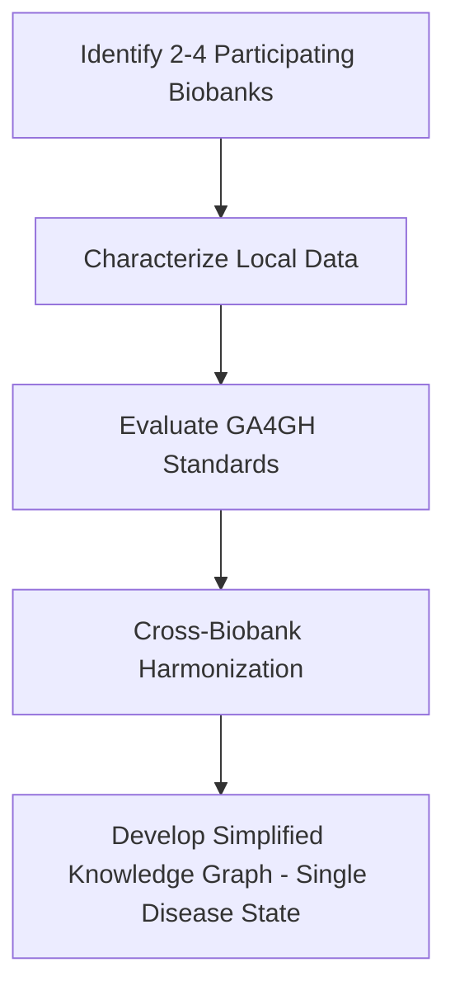

# Cross Biobank Data Access
Cross-Biobank Data Access &amp; Harmonization

## Team Members

|Name|Email|
|---|---|
|Ravi Madduri (Team Lead) | madduri@anl.gov|
|Derek Mu | derekmu@andrew.cmu.edu|
|Mrunali Thokadiwala | emrunali@gmail.com	 |
|Alina Devkota | ad00139@mix.wvu.edu|
||ailisib@andrew.cmu.edu|
||peiran@cmu.edu|
|Jacob Thrasher| jdt0025@mix.wvu.edu |
||prashnna.gyawali@mail.wvu.edu|
||surathas@andrew.cmu.edu |
|Rodela| |
|Pete Lawson | plawson@jhu.edu|
| Jiahao | leah12577@gmail.com |
|Abhijit Chunduru | schunduru@umass.edu|

## Flowchart

### Data Harminzation Workflow 

