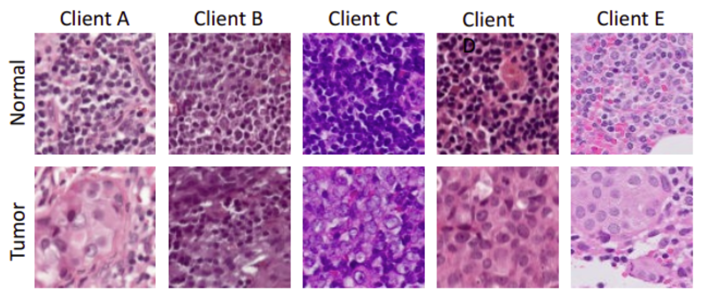
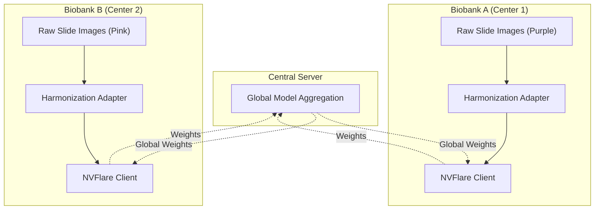
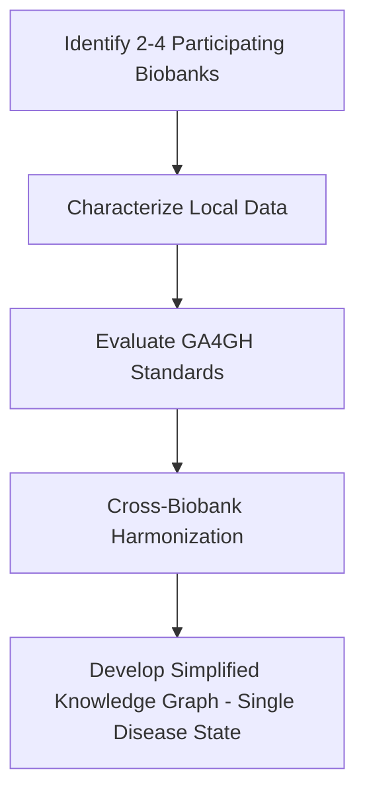

# Cross-Biobank Data Access & Harmonization

### *Federated Harmonization for Multi-Center Digital Pathology*

 

## Team Members

| Name                     | Email                          |
|--------------------------|--------------------------------|
| Ravi Madduri (Team Lead) | madduri\@anl.gov               |
| Derek Mu                 | derekmu\@andrew.cmu.edu        |
| Mrunali Thokadiwala      | emrunali\@gmail.com            |
| Alina Devkota            | ad00139\@mix.wvu.edu           |
| Alis Bao                 | ailisib\@andrew.cmu.edu        |
| Peiran Jiang             | peiran\@cmu.edu                |
| Jacob Thrasher           | jdt0025\@mix.wvu.edu           |
| Prashnna Gyawali         | prashnna.gyawali\@mail.wvu.edu |
| Suratha Sriram           | surathas\@andrew.cmu.edu       |
| Rodela                   | mrozbu\@alumni.cmu.edu         |
| Pete Lawson              | plawson\@jhu.edu               |
| Jiahao He                | leah12577\@gmail.com           |
| Abhijit Chunduru         | schunduru\@umass.edu           |

## Problem Statement:

In precision medicine, integrating data from different biobanks is hindered by **domain shifts**. A Federated Learning model trained on "raw" data from disjoint hospitals often fails to generalize because it learns to recognize *site-specific artifacts* rather than biological pathology.

In the **CAMELYON17** dataset, we observe significant heterogeneity across 5 medical centers due to differences in staining protocols and scanners:

   <em>Figure 1: Visualizing the domain shift. Note how Client C is purple-heavy while Client E is pink-heavy. (Source: CAMELYON17)</em>

**The Challenge:** A standard AI model might incorrectly learn that "Pink = Tumor" or "Purple = Normal" simply based on which hospital the data came from.

## Our Solution:

We propose a **Data-Side Harmonization Adapter** integrated with **NVIDIA FLARE**.

Instead of aggregating raw, discordant data, each client standardizes its histology slides locally using a **Stain Normalization** technique before participating in the federation. This ensures that the global model learns morphological features rather than overfitting to color artifacts.

### Architecture:

## Flowchart:

### Data Harmonization Workflow

## Methods

### Data Sources

**Patch Based Histopathology:** The CAMELYON17 dataset comprises 1,300 hematoxylin and eosin (H&E)–stained sentinel lymph node whole-slide images (WSIs) from breast cancer patients. Using a patch-based variant of CAMELYON17 \[4\], approximately 450,000 patches of size 96 × 96 pixels were extracted from the WSIs. Each WSI was manually annotated by pathologists to delineate tumor regions, and the resulting segmentation masks were used to assign binary labels (tumor or non-tumor) to each patch.

**Biobank Proxy**: The CAMELYON17 dataset includes whole slide images from five pathology centers: RadboudUMC, UMCU, Erasmus MC, UMCG and the Institute Jules Bordet. By treating each pathology center as a proxy for a separate biobank, we can explore the impact of a diverse range of staining protocols, slide preparation methods, and scanning equipment on inter-center variability, and the need for data harmonization across sites.

### Data Harmonization

Due to the inter-center variability in staining protocols, slide preparation methods, and scanning equipment in the CAMELYON17 dataset, harmonizing the visual representation of histopathology images is critical for ensuring robust model performance across sites. To address this challenge, we developed a harmonization approach based on the Beer-Lambert law to compute image-level frequency information for each whole-slide hematoxylin and eosin (H&E) image. This approach captures the spectral characteristics of each WSI, representing key staining features (e.g., variations in hematoxylin and eosin absorption) in a quantitative and standardized manner.

In a federated learning framework, this image-level frequency information is computed locally at each site and sent back to a central server. The centralized server aggregates these frequency profiles to compute a global average representation of staining parameters across sites. This global average is then shared back with each site, enabling local adjustments of staining features to align with the harmonized global baseline. By ensuring consistency in image representation using global H&E harmonization, this approach minimizes inter-center drift while preserving the fidelity of clinically relevant features within the histopathology images.

### Experimental Setup

- Federated Averaging (naive harmonization): Each center trains a local model on its patches; model weights are periodically averaged across centers using FedAvg via NVFLARE, without explicit stain harmonization.

- Beer–Lambert Stain Normalization (smart harmonization): Patches are first stain-normalized to reduce inter-center variability, then local models are trained and aggregated using FedAvg in NVFLARE.

- Pooled Centers (centralized evaluation): Patches from all five centers are combined into a single dataset, and a centralized model is trained to evaluate the performance difference between conventional centralized training and federated approaches.
  
## References:

1.  **CAMELYON17 Dataset:** Litjens, G., et al. (2018). *1399 H&E-stained sentinel lymph node sections of breast cancer patients: the CAMELYON dataset.* GigaScience.

2.  M. Jiang, Z. Wang, and Q. Dou, “HarmoFL: Harmonizing Local and Global Drifts in Federated Learning on Heterogeneous Medical Images,” Proceedings of the AAAI Conference on Artificial Intelligence, vol. 36, no. 1, pp. 1087–1095, June 2022, doi: 10.1609/aaai.v36i1.19993.

3.  T. Xu, Y. Wu, A. K. Tripathi, M. M. Ippolito, and B. D. Haeffele, “Adaptive Stain Normalization for Cross-Domain Medical Histology,” vol. 15966, 2026, pp. 24–33. doi: 10.1007/978-3-032-04981-0_3.

4.  P. Bandi et al., “From Detection of Individual Metastases to Classification of Lymph Node Status at the Patient Level: The CAMELYON17 Challenge,” IEEE Trans Med Imaging, vol. 38, no. 2, pp. 550–560, Feb. 2019, doi: 10.1109/TMI.2018.2867350.
