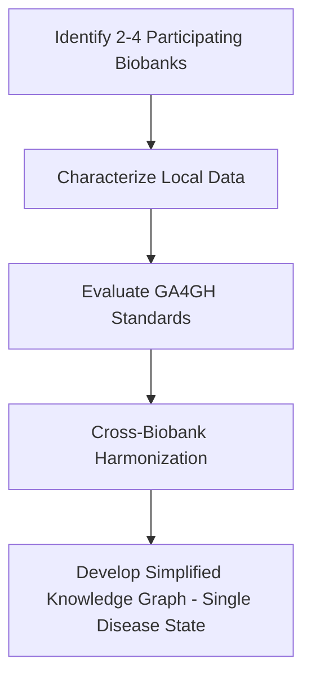

# Cross_biobank_data_access
Cross-Biobank Data Access &amp; Harmonization
## Team Members

Ravi Madduri | madduri@anl.gov
Derek Mu | derekmu@andrew.cmu.edu
Manali Gokhale | emrunali@gmail.com	 
Alina Devkota | ad00139@mix.wvu.edu
ailisib@andrew.cmu.edu
peiran@cmu.edu
prashnna.gyawali@mail.wvu.edu
surathas@andrew.cmu.edu 
Pete Lawson | plawson@jhu.edu

## Flowchart

### Data Harminzation Workflow 

