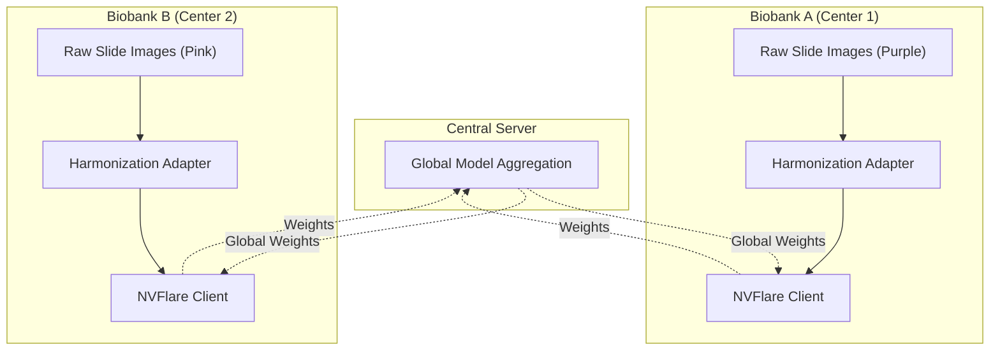
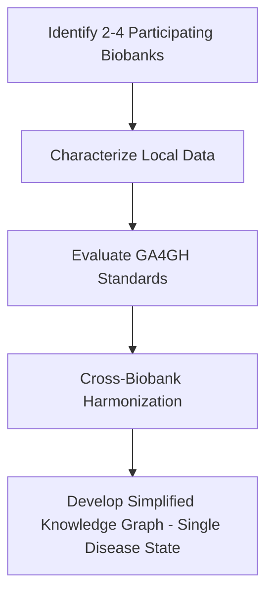

# Cross-Biobank Data Access & Harmonization
### *Federated Harmonization for Multi-Center Digital Pathology*

## Team Members

|Name|Email|
|---|---|
|Ravi Madduri (Team Lead) | madduri@anl.gov|
|Derek Mu | derekmu@andrew.cmu.edu|
|Mrunali Thokadiwala | emrunali@gmail.com|
|Alina Devkota | ad00139@mix.wvu.edu|
|Alis Bao | ailisib@andrew.cmu.edu|
|Peiran Jiang | peiran@cmu.edu|
|Jacob Thrasher | jdt0025@mix.wvu.edu|
|Prashnna Gyawali | prashnna.gyawali@mail.wvu.edu|
|Suratha Sriram | surathas@andrew.cmu.edu |
|Rodela | mrozbu@alumni.cmu.edu|
|Pete Lawson | plawson@jhu.edu|
|Jiahao He | leah12577@gmail.com|
|Abhijit Chunduru | schunduru@umass.edu|

## Problem Statement:

In precision medicine, integrating data from different biobanks is hindered by **domain shifts**. A Federated Learning model trained on "raw" data from disjoint hospitals often fails to generalize because it learns to recognize *site-specific artifacts* rather than biological pathology.

In the **CAMELYON17** dataset, we observe significant heterogeneity across 5 medical centers due to differences in staining protocols and scanners:

  
   
  <em>Figure 1: Visualizing the domain shift. Note how Client C is purple-heavy while Client E is pink-heavy. (Source: CAMELYON17)</em>

**The Challenge:** A standard AI model might incorrectly learn that "Pink = Tumor" or "Purple = Normal" simply based on which hospital the data came from.

## Our Solution: 

We propose a **Data-Side Harmonization Adapter** integrated with **NVIDIA FLARE**. 

Instead of aggregating raw, discordant data, each client standardizes its histology slides locally using a **Stain Normalization** technique before participating in the federation. This ensures that the global model learns morphological features rather than overfitting to color artifacts.

### Architecture:

## Flowchart:

### Data Harmonization Workflow 

## References:
1.  **CAMELYON17 Dataset:** Litjens, G., et al. (2018). *1399 H&E-stained sentinel lymph node sections of breast cancer patients: the CAMELYON dataset.* GigaScience.
